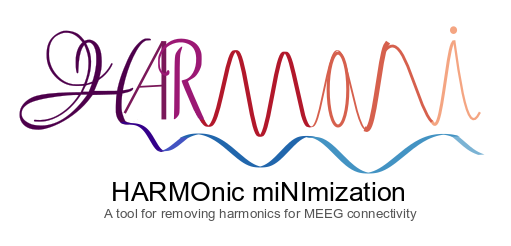

# Supplementary Data of the Manuscript

  

<h2>Harmoni: a Novel Method for Eliminating Spurious Neuronal Interactions due to the Harmonic Components in Neuronal Data</h2>
Mina Jamshidi Idaji, Jaunli Zhang, Tilman Stephani, Guido Nolte, Klaus-Robert Mueller, Arno Villringer, Vadim V. Nikulin
INSERT THE DOIs

(c) Mina Jamshidi (minajamshidi91@gmail.com) @ Neurolgy Dept, MPI CBS, 2021
https://github.com/minajamshidi

-----------------------------------------------------------------------

Here, for the sake of reproducibility, the following supplementary data for the above manuscript are provided. 

The original repository: https://github.com/harmonic-minimization

* fsaverage-head: forward and inverse solutions of fsaverage, used in the manuscript

* Results: 

	- Toy example results. in the pickle files the seeds of generating the data presented in the manuscript are provided 

	- Realistic simulations. [to be completed]

* simulated_data: here the simulated data are partly provided [to be completed]

-----------------------------------------------------------------------

<h3>Versions</h3>

###### version 1.0
`Oct. 2021` Data contributing to the first bioRxiv preprint at xxDOIxx
